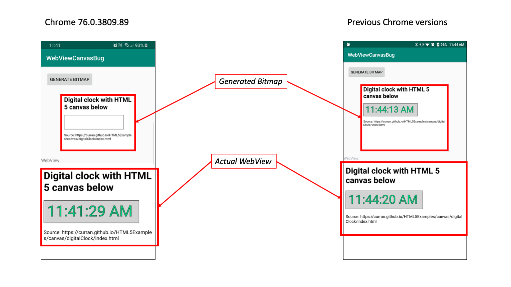

# Android WebView - Rendering of HTML 5 canvas to Bitmap or OpenGL texture

This project shows to example where the Android Webview is rendered to
1. A Bitmap (displayed via an ImageView)
2. An OpenGL texture

With latest version of Chrome (76.0.3809.89), the HTML 5 canvas are not rendered anymore.

With previous versions, it was working properly.

## Screenshot

## References

* OpenGL implementation based on https://github.com/arthabus/AndroidViewToGLRendering
